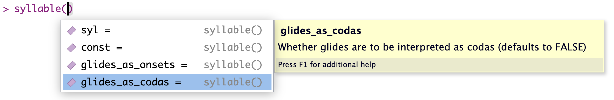
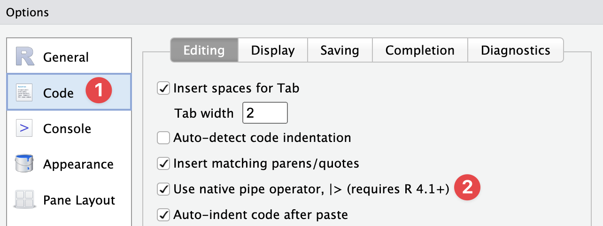

```{r setup, include=FALSE}
options(htmltools.dir.version = FALSE)
knitr::opts_chunk$set(
  collapse = TRUE,
  comment = "#>"
)
```

class: inverse, center, middle

# Fonology
## Um pacote R para análise fonológica
### Guilherme D. Garcia


#### Université Laval • CRBLM

---

```{r xaringan-tile-view, echo=FALSE}
xaringanExtra::use_tile_view()
xaringanExtra::use_scribble()
xaringanExtra::use_clipboard()
xaringanExtra::use_progress_bar(location = "bottom", color = "darkred")
options(htmltools.dir.version = FALSE)
xaringanExtra::use_editable()
xaringanExtra::use_extra_styles(
  hover_code_line = TRUE,         #<<
  mute_unhighlighted_code = FALSE  #<<
)
```


## O que é 🤔


- Um pacote em R com diversas funções (específicas e gerais)
- Atualmente em desenvolvimento; atualizações frequentes

- **Esta apresentação**: demo das principais funções com exemplos reais

--

## Motivação

> Automatizar codificação e processamento de dados fonológicos

--

## Conteúdo

- Componente **analítico**: velocidade e precisão (escalabilidade)
- Componente **didático**: interatividade e acessibilidade 

---

## Instalação etc. 🧐

- Visite [gdgarcia.ca/fonology](https://gdgarcia.ca/fonology) para informações e demos detalhadas
- Para instalar o pacote, é necessário ter o pacote `devtools`:

```{r, echo=T, eval=FALSE}
library(devtools) # install.packages("devtools")
install_github("guilhermegarcia/fonology")
```

--

## Feedback, bugs, dúvidas 🪲

- Crie uma entrada em [github.com/guilhermegarcia/fonology/issues](https://github.com/guilhermegarcia/fonology/issues)

--

## Premissa

- Familiaridade básica com R e com a família `tidyverse`

---

## De grafemas a fonemas 📜

> *Pouca coisa pode ser feita se não convertemos grafemas em fonemas*

<br>
- <h-l>Dados escritos</h-l>: fáceis de encontrar, difíceis de analisar (e.g., grafemas ≠ fonemas; silabificação, acento)
- Transcrição fonêmica: ponto de partida **essencial** 

--

## Nestes slides

- Demo das principais funções:
1. <h-l>Transcrição fonêmica</h-l>
--

2. Extração de acento/sílaba, constituintes silábicos
--

3. Cálculo e visualização de sonoridade
--

4. Trapézio vocálico
--

5. Classes naturais
--

6. Gerador de palavras + probabilidade fonotática
--

7. Formantes + `ggplot2`


---

## Exemplo 1: transcrição ampla

- `ipa_pt(...)`: transcrição de palavras do português

```{r, echo = TRUE}
library(Fonology)

ipa_pt("concentração")
ipa_pt("tipos")
ipa_pt("quiséssemos")
ipa_pt("parangaricutirrimirruaro")
```

--

- Função **não vetorizada** (i.e., serial): ideal para *um* input
- <h-l>Diferencial</h-l>: atribuição probabilística de acento, útil para palavras novas

---

## Exemplo 2: transcrição fina

- `ipa_pt(..., narrow = T)`

```{r, echo = TRUE}
ipa_pt("concentração", narrow = T)
ipa_pt("tipos", narrow = T)
ipa_pt("quiséssemos", narrow = T)
ipa_pt("parangaricutirrimirruaro", narrow = T)
```

- Função **não vetorizada** (i.e., serial): ideal para *um* input
- <h-l>Diferencial</h-l>: acento é atribuído **probabilisticamente**, útil para palavras novas

---

## Exemplo 3: transcrição em massa

- <h-l>Essencial</h-l>: poder transcrever grandes quantidades de palavras
- `ipa_pt_vec(...)`: transcrição vetorizada


```{r, echo = TRUE}
ipa_pt_vec(word = c("Exemplo", "com", "múltiplas", "palavras"))
```

--

- Transcrição fina também disponível:

```{r, echo = TRUE}
ipa_pt_vec(word = c("Encontramos", "transcrição", "fonética", "fina", "também"), narrow = T)
```

- Função **vetorizada** (i.e., paralela): ideal para *muitos* dados
- <h-l>Diferencial</h-l>: velocidade (*mas* acento é atribuído **categoricamente**)


---

## Exemplo 4: texto curto 💬

- `ipa_pt_vec()` exige um input tokenizado
- E se nosso input for um texto...?
- <mark>`cleanText()`</mark>: limpeza e tokenização

```{r, echo = TRUE, message = F, tidy=FALSE}
library(tidyverse) # Para usarmos %>% + outras funções mais tarde
texto = "Este é um teXto 123# bastante cUrto que Não está tokenizado"

texto %>% 
  cleanText() %>% #<<
  ipa_pt_vec()

```

---

## Exemplo 5: texto curto em tabela 💬

- Normalmente, análises começam com *data frames* ou *tibbles*

```{r, echo = TRUE}
texto = "Este é um teXto 123# bastante cUrto que Não está tokenizado"

tabela = tibble(palavra = texto %>% cleanText()) %>% # Coluna com palavras
  mutate(ipa = palavra %>% ipa_pt_vec()) # Coluna com transcrição

```

--

```{r, echo = F, message = F}
library(kableExtra)
tabela %>% 
  slice(1:6) %>% 
  kable(booktabs = T) %>% 
  kable_styling()
```

---

## Exemplo 6: texto longo em tabela 📚

- `getStress()`: extração de acento a partir de transcrição
- `stopwords_pt`: lista de palavras funcionais
- <mark>`syllable()`</mark>: extração de constituintes silábicos

```{r, echo = T}
lus1 = read_lines("lusiadas.txt") # Importamos o texto integral

lus2 = lus1 %>% 
  cleanText() %>% # Limpamos e tokenizamos o texto 
  as_tibble() %>% 
  rename(word = value) %>% 
  filter(!word %in% stopwords_pt) %>% # Removemos stopwords
  mutate(ipa = ipa_pt_vec(word), # Criamos uma coluna para transcrição
         stress = getStress(ipa), # outra para o acento
         finSyl = getSyl(word = ipa, pos = 1), # outra para a sílaba final
         onsetFin = syllable(finSyl, const = "onset"), #<<
         nucFin = syllable(finSyl, const = "nucleus"), #<<
         codaFin = syllable(finSyl, const = "coda"), #<<
         rimaFin = syllable(finSyl, const = "rhyme")) #<<
```

--

⏱️ total para executar o código acima: **< 2s** (M1 Pro)

---

## Exemplo 6: texto longo em tabela 📚

```{r, echo = F}
lus2 %>% 
  slice(1:5) %>% 
  kable(booktabs = T) %>% 
  kable_styling()
```

--

- Total de `r nrow(lus2)` palavras lexicais
- Glides são onsets, codas, ou estão no núcleo...❓ 

--

<div align = "center">

</div>

---

## Exemplo 7: sonoridade 🔉

- `demi(word = ..., d = ...)`: extração de demissílabas (`d` = `1` ou `2`)

```{r}
syllables = c("kom", "sil", "fran", "klas")

demis = syllables %>% 
  demi(d = 1) # extrair primeira demissílaba de cada sílaba

demis
```

---

## Exemplo 7: sonoridade 🔉

- Também podemos calcular a média de dispersão de sonoridade em um vetor com `meanSonDisp()`:

```{r}
syllables %>% 
  demi(d = 1) %>% 
  meanSonDisp()
```

- **Nota**: A função usa 17 níveis de sonoridade (ver Parker 2011)<sup>1</sup>

.footnote[[1] Parker, S. (2011). Sonority. In M. van Oostendorp, C. J. Ewen, E. Hume, & K. Rice (Eds.), *The Blackwell companion to phonology* (pp. 1160–1184). Wiley Online Library. https://doi.org/10.1002/9781444335262.wbctp0049]

---

## Exemplo 8: sonoridade 🔊

- Para o ensino de fonologia: visualizar o princípio de sonoridade pode ser útil

.pull-left[

```{r, fig.align='center', fig.width=6.5, fig.height=4, fig.retina=TRUE, dpi=800}
"combradol" %>% 
  ipa_pt() %>% 
  plotSon(syl = F) #<<
```
]

--

.pull-right[

```{r, fig.align='center', fig.width=6.5, fig.height=4, fig.retina=TRUE, dpi=800}
"pontilhonde" %>% 
  ipa_pt() %>% 
  plotSon(syl = T) #<<
```
]

---

## Exemplo 9: trapézio vocálico

- `plotVowels()` gera trapézios para algumas línguas
- A função também exporta opcionalmente o arquivo `tex` para quem utiliza $\LaTeX$

.pull-left[

```{r, fig.align='center', fig.width=6.5, fig.height=4, fig.retina=TRUE, dpi=800}
plotVowels(lg = "Spanish", 
           tex = F) #<<
```
]

--

.pull-right[

```{r, fig.align='center', fig.width=6.5, fig.height=4, fig.retina=TRUE, dpi=800}
plotVowels(lg = "Italian", 
           tex = F) #<<
```
]


---

## Exemplo 10: classes naturais e traços distintivos 

- De fonemas a traços usando `getFeat()`:

```{r}
getFeat(ph = c("i", "u"), lg = "English")
getFeat(ph = c("p", "b"), lg = "French")
getFeat(ph = c("i", "y", "u"), lg = "French")
```

--

- De traços a fonemas usando `getPhon()`:

```{r}
getPhon(ft = c("+syl", "+hi"), lg = "French")
getPhon(ft = c("-DR", "-cont", "-son"), lg = "English")
getPhon(ft = c("-son", "+vce"), lg = "Spanish")
```

---

## Exemplo 11: gerador de palavras e probabilidade fonotática 🎲

- `wug_pt()` cria palavras

```{r}
set.seed(1)
wug_pt(profile = "LHL")
```

--

- Vamos criar uma tabela com 8 palavras novas + probabilidade fonotática com <mark>`biGram_pt()`</mark>:

```{r, message = F}
set.seed(1)
gerador = tibble(palavra = character(8)) %>% # Criamos espaço para 8 palavras
  mutate(palavra = wug_pt("LHL", n = 8), # Especificamos o perfil de peso
         bigrama = palavra %>% 
           biGram_pt() #<<
  ) 
```

---

## Exemplo 11: gerador de palavras e probabilidade fonotática 🎲

.pull-left[
- Bigramas menores $\rightarrow$ menos prováveis

```{r, echo = F}
gerador %>% 
  arrange(desc(bigrama)) %>% 
  kable(booktabs = T) %>% 
  kable_styling(full_width = F)
```
]

--

.pull-right[
- Bigramas calculados com base no [PSL](https://gdgarcia.ca/psl)
- Acesse o léxico simplificado com `pt_lex`
- Ou o léxico completo com `psl`

```{r}
set.seed(1)
pt_lex %>% sample_n(5)
```
]

---

## Exemplo 12: Listando bigramas 🎲

.pull-left[
```{r, echo = T}
lus_bigramas = lus1 %>% 
  cleanText() %>% 
  ipa_pt_vec() %>% 
  biGram_tbl() #<<
```

```{r, echo = F}
lus_bigramas %>% 
  slice(1:8) %>% 
  kable(booktabs = T) %>% 
  kable_styling(full_width = F)
```
]

--

.pull-right[
- <mark>`biGram_tbl()`</mark> $\rightarrow$ todos os bigramas
- Assim, podemos facilmente plotar padrões


### Visualizando bigramas

- Em conjunto com `biGram_tbl()`:
- <mark>`plot_biGrams()`</mark> $\rightarrow$ gráficos com `ggplot2`


- Duas opções de gráficos para a função:
  1. `type = "heat"`
  2. `type = "lollipop"`

- Em ambas, definimos o número de bigramas `n`
]

---

## Exemplo 12: Vizualisando bigramas 🎲

.pull-left[
```{r, fig.align='center', fig.width=4, fig.height=3, fig.retina=TRUE, dpi=800}
lus_bigramas %>% 
  plot_biGrams(type = "lollipop", n = 10) #<<
```
]

--

.pull-right[
```{r, fig.align='center', fig.width=4.25, fig.height=3, fig.retina=TRUE, dpi=800}
lus_bigramas %>% 
  plot_biGrams(type = "heat", n = 50) #<<
```
]

---


## Exemplo 13: gráfico de vogais 🗣️

- Um *wrapper* simples para F1/F2 em `ggplot2`. Exemplo com `vowels` (dados hipotéticos): 

```{r, fig.align='center', fig.width=5, fig.height=3, fig.retina=TRUE, dpi = 800, out.height="300px"}
ggplot(data = vowels, aes(x = F2, y = F1, color = vowel, label = vowel)) +
  geom_text() +
  theme_classic() + theme(legend.position = "none")
```

---

## Exemplo 13: gráfico de vogais 🗣️

- Um *wrapper* simples para F1/F2 em `ggplot2`. Exemplo com `vowels` (dados hipotéticos):

```{r, fig.align='center', fig.width=5, fig.height=3, fig.retina=TRUE, dpi = 800, out.height="300px"}
ggplot(data = vowels, aes(x = F2, y = F1, color = vowel, label = vowel)) +
  geom_text() +
  theme_classic() + theme(legend.position = "none") +
  formants() #<<
```

---

## Nota sobre o *pipe*

- Desde a versão **4.1**, o R possui um pipe nativo: `|>` (cf. `%>%` do pacote `magrittr`)
- Em análises com <h-l>altíssima quantidade</h-l> de dados, prefira `|>`
--

- `Fonology`: internamente, apenas `|>`; externamente, ambos os pipes podem ser usados
  - É possível mudar o *default* (para usar o atalho `Ctrl+Shift+m` ou `Cmd+Shift+m`):

<br>

<div align = "center">

</div>


---

class: inverse, center, middle

# Fim

```{r}
ipa_pt("obrigado", narrow = T) %>% str_c("!")
```

O projeto se beneficiou do programa ENVOL (Université Laval). Maiores informações em [gdgarcia.ca/fonology](https://gdgarcia.ca/fonology)