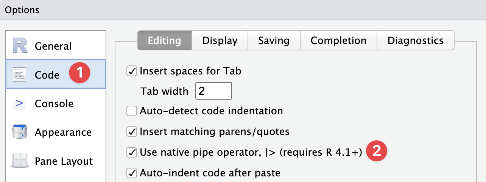

class: title-slide, inverse, center, middle

# Fonology
## Análise Fonológica em R 
### Guilherme D. Garcia 

<a href = "https://gdgarcia.ca" style="color: #FEC20B"></a>


#### Université Laval • CRBLM • CRIHN

---

<!--html_preserve--><style>.xe__progress-bar__container {
  bottom:0;
  opacity: 1;
  position:absolute;
  right:0;
  left: 0;
}
.xe__progress-bar {
  height: 0.25em;
  background-color: darkred;
  width: calc(var(--slide-current) / var(--slide-total) * 100%);
}
.remark-visible .xe__progress-bar {
  animation: xe__progress-bar__wipe 200ms forwards;
  animation-timing-function: cubic-bezier(.86,0,.07,1);
}
@keyframes xe__progress-bar__wipe {
  0% { width: calc(var(--slide-previous) / var(--slide-total) * 100%); }
  100% { width: calc(var(--slide-current) / var(--slide-total) * 100%); }
}</style><!--/html_preserve-->

## O que é 🤔


- Um pacote em R que ajuda fonólogos na automação de certas tarefas
- Atualmente em desenvolvimento; atualizações frequentes

- **Esta apresentação**: demo das principais funções com exemplos reais

--

## Motivação

> Automatizar codificação e processamento de dados fonológicos

--

## Conteúdo

- Componente **analítico**: velocidade e precisão (escalabilidade)
- Componente **didático**: interatividade e acessibilidade 

---


## Instalação etc. 🧐

- Visite [gdgarcia.ca/fonology](https://gdgarcia.ca/fonology) para informações e demos detalhadas
- Para instalar o pacote, é necessário ter o pacote `devtools`:


``` r
library(devtools) # install.packages("devtools")
install_github("guilhermegarcia/fonology")
```

--

## Feedback, bugs, dúvidas 🪲

- Crie uma entrada em [github.com/guilhermegarcia/fonology/issues](https://github.com/guilhermegarcia/fonology/issues)

--

## Premissa

- Familiaridade básica com R e com a família `tidyverse`

---


## Nota sobre o *pipe* (`|>` vs `%>%`)

- Desde a versão **4.1**, o R possui um pipe nativo: `|>` (cf. `%>%` do pacote `magrittr`)
- Em análises com <h-l>altíssima quantidade</h-l> de dados, prefira `|>`
--

- `Fonology`: internamente, apenas `|>`; externamente, ambos os pipes podem ser usados
- É possível mudar o *default* (para usar o atalho `Ctrl+Shift+m` ou `Cmd+Shift+m`):

<br>

<div align = "center">

</div>

---

## Itinerário 🗺️

### Demo das principais funções:

1. <h-l>Transcrição fonêmica</h-l>
--

2. Extração de acento/sílaba, constituintes silábicos
--

3. Cálculo e visualização de sonoridade
--

4. Trapézio vocálico
--

5. Classes naturais
--

6. Gerador de palavras + probabilidade fonotática
--

7. Formantes + `ggplot2`
--

8. De IPA para TIPA

***

<br>

> *Pouca coisa pode ser feita se não convertemos grafemas em fonemas*

<br>
- <h-l>Dados escritos</h-l>: fáceis de encontrar, difíceis de analisar (e.g., grafemas ≠ fonemas; silabificação, acento)
- Transcrição fonêmica: ponto de partida **essencial**


---

class: inverse, center, middle

# Principais funções

---

## Exemplo 1: transcrição ampla

- `ipa_pt(...)`: transcrição de palavras


``` r
library(Fonology)

ipa_pt("concentração")
#> [1] "kon.sen.tra.ˈsãw̃"
ipa_pt("tipos")
#> [1] "ˈti.pos"
ipa_pt("quiséssemos")
#> [1] "ki.ˈzɛ.se.mos"
ipa_pt("parangaricutirrimirruaro")
#> [1] "pa.ran.ga.ri.ku.ti.xi.mi.xu.ˈa.ro"
```

--

- Função **não vetorizada** (i.e., serial): ideal para *um* input
- <h-l>Diferencial</h-l>: atribuição probabilística de acento, útil para palavras novas

---

## Exemplo 2: transcrição fina

- `ipa_pt(..., narrow = T)`


``` r
ipa_pt("concentração", narrow = T)
#> [1] "kõn.ˌsẽj̃ɲ.tɾa.ˈsãw̃"
ipa_pt("tipos", narrow = T)
#> [1] "ˈt͡ʃi.pʊs"
ipa_pt("quiséssemos", narrow = T)
#> [1] "ki.ˈzɛ.se.mʊs"
ipa_pt("parangaricutirrimirruaro", narrow = T)
#> [1] "ˌpa.ɾãŋ.ˌga.ɾi.ˌku.t͡ʃi.ˌxi.mi.ˈxu.a.ɾʊ"
```

- Função **não vetorizada** (i.e., serial): ideal para *um* input
- <h-l>Diferencial</h-l>: acento é atribuído **probabilisticamente**, útil para palavras novas

---

## Exemplo 3: transcrição em massa

- <h-l>Essencial</h-l>: poder transcrever grandes quantidades de palavras
- `ipa(...)`: transcrição vetorizada (<h-l>português e espanhol</h-l>)


``` r
ipa(word = c("Exemplo", "com", "múltiplas", "palavras"))
#>              1              2              3              4 
#>   "e.ˈzem.plo"         "ˈkom" "ˈmul.tip.las"  "pa.ˈla.vras"
```

--

- Transcrição fina também disponível (para o português):


``` r
ipa(word = c("Encontramos", "transcrição", 
             "fonética", "fina", "também"), 
    narrow = T)
#>                   1                   2                   3                   4                   5 
#> "ˌẽj̃ɲ.kõn.ˈtɾã.mʊs"   "ˌtɾãns.kɾi.ˈsãw̃"     "fo.ˈnɛ.t͡ʃi.ka"            "ˈfĩ.na"         "tãm.ˈbẽj̃ɲ"
```

- Função **vetorizada** (i.e., paralela): ideal para *muitos* dados
- <h-l>Diferencial</h-l>: velocidade (*mas* acento é atribuído **categoricamente**)


---

## Exemplo 4: texto curto 💬

- `ipa()` exige um input tokenizado
- E se nosso input for um texto...?
- <mark>`cleanText()`</mark>: limpeza e tokenização


``` r
library(tidyverse)
texto = "Este é um teXto 123# bastante cUrto que Não está tokenizado"

texto |> 
  cleanText() |> #<<
  ipa()
#>                 1                 2                 3                 4                 5                 6 
#>          "ˈes.te"              "ˈɛ"             "ˈum"         "ˈtes.to"               "ˈ"     "bas.ˈtan.te" 
#>                 7                 8                 9                10                11 
#>         "ˈkur.to"             "ˈke"            "ˈnãw̃"          "es.ˈta" "to.ke.ni.ˈza.do"
```

---

## Exemplo 5: texto curto em tabela 💬

- Normalmente, análises começam com *data frames* ou *tibbles*


``` r
texto = "Este é um teXto 123# bastante cUrto que Não está tokenizado"

tabela = tibble(palavra = texto |> cleanText()) |> # Coluna com palavras
  mutate(ipa = palavra |> ipa()) # Coluna com transcrição

```

--

<table class="table" style="margin-left: auto; margin-right: auto;">
 <thead>
  <tr>
   <th style="text-align:left;"> palavra </th>
   <th style="text-align:left;"> ipa </th>
  </tr>
 </thead>
<tbody>
  <tr>
   <td style="text-align:left;"> este </td>
   <td style="text-align:left;"> ˈes.te </td>
  </tr>
  <tr>
   <td style="text-align:left;"> é </td>
   <td style="text-align:left;"> ˈɛ </td>
  </tr>
  <tr>
   <td style="text-align:left;"> um </td>
   <td style="text-align:left;"> ˈum </td>
  </tr>
  <tr>
   <td style="text-align:left;"> texto </td>
   <td style="text-align:left;"> ˈtes.to </td>
  </tr>
  <tr>
   <td style="text-align:left;">  </td>
   <td style="text-align:left;"> ˈ </td>
  </tr>
  <tr>
   <td style="text-align:left;"> bastante </td>
   <td style="text-align:left;"> bas.ˈtan.te </td>
  </tr>
</tbody>
</table>


---

## Exemplo 6: texto longo em tabela 📚


### Tarefa

1. Importar *Os Lusíadas*, limpar e tokenizar o texto
2. Transcrever, silabificar, acentuar palavras lexicais
3. Extrair acento e última sílaba
4. Extrair constituintes da última sílaba de cada palavra

--

### Ferramentas/funções

- `getStress()`: extração de acento a partir de transcrição
- `getWeight()`: extração de perfil de peso (e.g., `LLH`)
- `getSyl()`: extração de uma sílaba
- `syllable()`: extração de constituintes silábicos
- `stopwords_pt` e `stopwords_sp`: listas de palavras funcionais

---

## Exemplo 6: texto longo em tabela 📚

.panelset[
.panel[.panel-name[Código]

``` r
lus1 = read_lines("lusiadas.txt")                         

lus2 = lus1 |> 
  cleanText() |>                                          # Limpamos e tokenizamos o texto 
  as_tibble() |> 
  rename(word = value) |> 
  filter(!word %in% stopwords_pt) |>                      # Removemos palavras funcionais
  mutate(ipa = ipa(word),                                 # Criamos uma coluna para transcrição
         stress = getStress(ipa),                         # outra para o acento
         weight = getWeight(ipa),                         # outra para o peso
         finSyl = getSyl(word = ipa, pos = 1),            # outra para a sílaba final
         onsetFin = syllable(finSyl, const = "onset"),
         nucFin = syllable(finSyl, const = "nucleus"),
         codaFin = syllable(finSyl, const = "coda"), 
         rimaFin = syllable(finSyl, const = "rhyme"))
#> Error in `mutate()`:
#> ℹ In argument: `ipa = ipa(word)`.
#> Caused by error:
#> ! `ipa` must be size 33720 or 1, not 32618.
```


